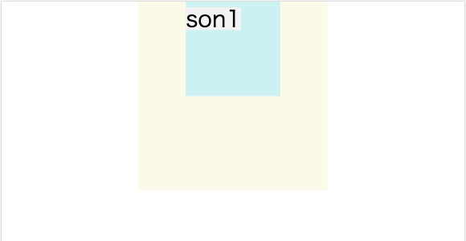
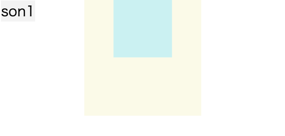
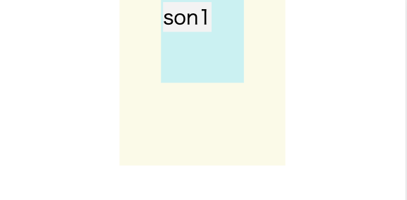

# 前端杂谈之position

由于自己对position的具体用法总是一知半解，所以想通过书写的方式来加深对此知识点的理解，达到温故知新的目的。

## Demo
```html
<!DOCTYPE html>
<html>
<head>
</head>

<style type="text/css" media="screen">
*{
    margin: 0;
    padding: 0;
} 
#son1
{
    background-color: #8080C0;
}

#parent{
    /* position: relative; */
    width: 200px;
    height: 200px;
    margin: 0 auto;
    background-color: #D5F3F4;
}
#grand-parent{
    /* position: relative; */
    width: 400px;
    height: 400px;
    background-color: #FBFBEA;
    margin: 0 auto;
}

</style>

<body>
    <div id="grand-parent">
        <div id="parent">
            <span id="son1">son1</span>
        </div>
    </div>   
</body>

</html>

```
#### Demo的原始效果



## fixed, absolute, relative, static的区别


### static

static最好理解，就是在position的默认值（什么都不设置的情况下）。

### absolute
absolute顾名思义就是绝对的意思，但它到底对谁绝对呢？主要分两种情况：
1. 它的父元素或曾父（曾曾父等等）不设置position（即既不是relative，也非absolute）的情况下，它是相对于浏览器的窗口进行绝对定位的。

```html
<!DOCTYPE html>
<html>
<head>
</head>

<style type="text/css" media="screen">
*{
    margin: 0;
    padding: 0;
} 
#son1
{
    position: absolute;
    top:5px;
    left:5px;
    background-color: #8080C0;
}

#parent{
    /* position: relative; */
    width: 200px;
    height: 200px;
    margin: 0 auto;
    background-color: #D5F3F4;
}
#grand-parent{
    /* position: relative; */
    width: 400px;
    height: 400px;
    background-color: #FBFBEA;
    margin: 0 auto;
}

</style>

<body>
    <div id="grand-parent">
        <div id="parent">
            <span id="son1">son1</span>
        </div>
    </div>   
</body>

</html>

```

#### son1设置absolute之后的效果


注意：倘若不指定top，left，bottom，right的话，son1与原来的位置一致，不发生变化


2. 它的父元素或曾父（曾曾父等等）设置position（即relative或absolute）的情况下，它是相对于父元素或曾父（曾曾父等等）进行绝对定位的。比如，父元素设置了position，那么它就是相对于父元素进行位置变化。又比如，它的父元素没有设置position，但它的曾父设置了position，那么它就是相对于曾父进行位置变化。以此类推。

```html
<!DOCTYPE html>
<html>
<head>
</head>

<style type="text/css" media="screen">
*{
    margin: 0;
    padding: 0;
} 
#son1
{
    position: absolute;
    top:5px;
    left:5px;
    font-size: 3em;
    background-color: #f5f5f5;
}

#parent{
    position: relative;
    width: 200px;
    height: 200px;
    margin: 0 auto;
    background-color: #D5F3F4;
}
#grand-parent{
    /* position: relative; */
    width: 400px;
    height: 400px;
    background-color: #FBFBEA;
    margin: 0 auto;
}

</style>

<body>
    <div id="grand-parent">
        <div id="parent">
            <span id="son1">son1</span>
        </div>
    </div>   
</body>

</html>

```
#### son1设置成absolute且父级元素的position为relative或absolute之后的效果

### fixed

fixed比较好理解，就是相对于浏览器窗口的位置，跟父元素没啥关系。其实，fixed是absolute的一种特殊用法，也就是absolute在父元素（或曾父等等）没有设置position的情况(即static以外)。

### relative

relative是相对的意思。而它对谁相对呢？其实它相对于它自己的位置。比如，它本来在什么位置，如果用了
```html
position:relative; 
left:5px;
```
那么就是在自己原来的位置上，向左偏移了5px。

以上就是我对position的理解。

