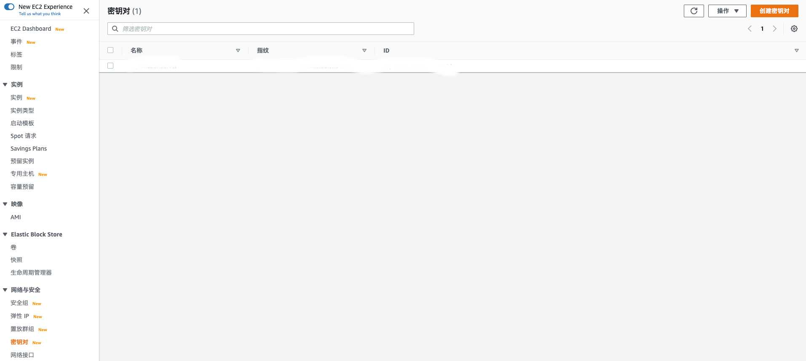
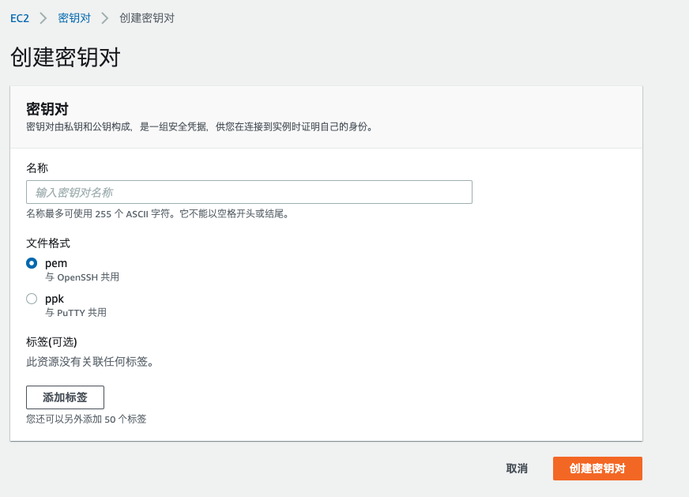

# 本地vscode连接linux

本文主要讲解如何通过ssh将本地的vscode与linux进行连接。

## 操作环境

云服务器：Amazon Linux 2 AMI
本地： masOS Catalina version 10.15.4 + vscode (version 1.47.2)

## 前提条件
1. Amazon Linux 2 AMI已经设置完毕，处于正常运行状态。
2. vscode在本地机器上安装完毕。


## 具体流程
### 1. 服务器端
#### 创建密钥对
进入亚马逊云的控制台，点击左下角的密钥对，如下图所示


然后点击右上角的创建密钥对，如下图所示

输入易懂的名称，然后文件格式选择pem，然后点击创建密钥对。此时，创建好的钥匙对***.pem会自动下载至本地。

### 2. 客户端（本地）
#### 移动密钥对位置并更改权限
这时候，打开终端将下载好的密钥对放到~/.ssh下面，并且更改权限。

```
mv /Users/username/Downloads/***.pem  ~/.ssh
chmod 600 /Users/username/.ssh/***.pem
```
`username`填你自己电脑的用户名，具体可以在终端输入`pwd`来查看当前的目录地址。
#### 用ssh在mac终端连接服务器
以上完成之后，只需在终端输入`ssh -i /Users/username/.ssh/***.pem ec2-user@ec2的IP地址或域名`

此时，就可以通过mac的终端连接到亚马逊服务器了。

#### vscode连接到服务器

接下来讲解如何通过客户端的vscode连接到linux。首先,要在vscode安装ssh development插件，安装完之后会出现以下这种小icon


然后按comman+p键，输入`>Remote-SSH: Open Configuration File...`，然后选择`/Users/username/.ssh/config`。接下来就可以往里面填写有关亚马逊服务器相关的信息了。比如：

```
Host Amazon-Server （此处只是名字，可随意取）
  HostName ************.compute.amazonaws.com （此处ip地址或域名）
  IdentityFile /Users/username/.ssh/***.pem （此处是你刚才下载下来，并存放~/.ssh下面的pem）
  User ec2-user (此处是用户名，亚马逊Amazon Linux 2 AMI的话一般是ec2-user)
  Port 22 (这里是端口号，默认是22。注意：倘若在服务器端改了端口号，在亚马逊的控制台安全组的地方也要添加相应的端口号，否则会显示connection refused)
 
  ```

  以上的信息添加完，保存。然后点击小icon，左上角会自动出现你刚才设置好的Host的名字。然后右击Host的名字，选择Connect to Host in New Window。到此，就可以连接上linux了。

  2020/9/27


